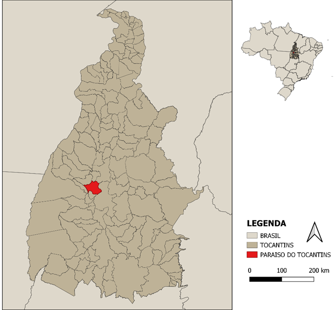
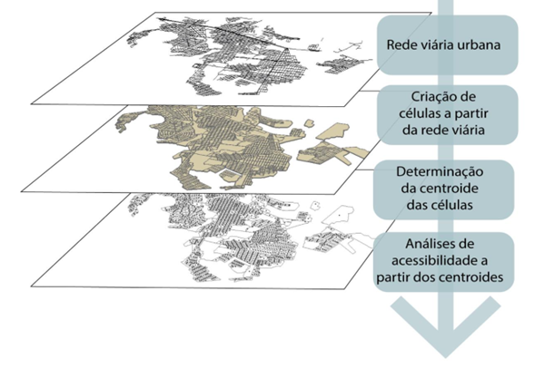
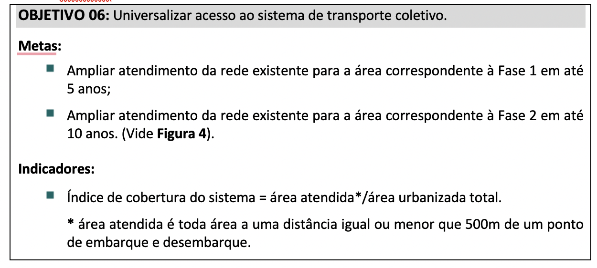
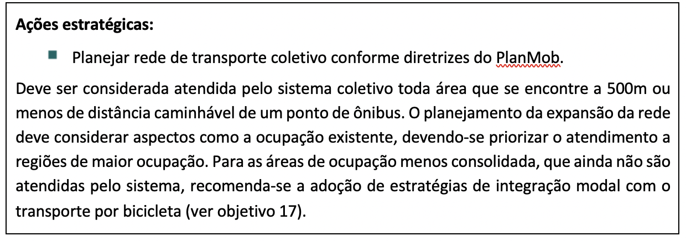
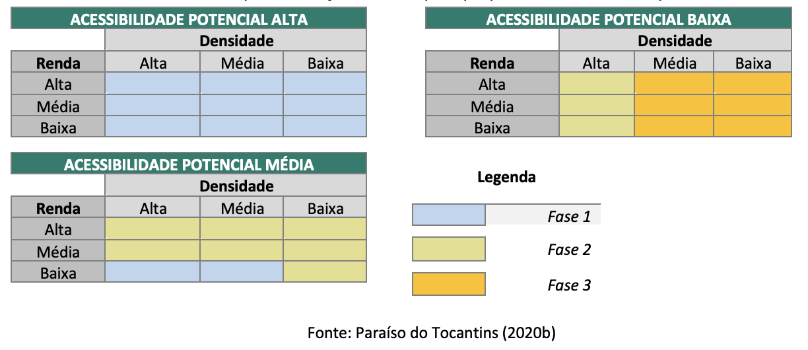
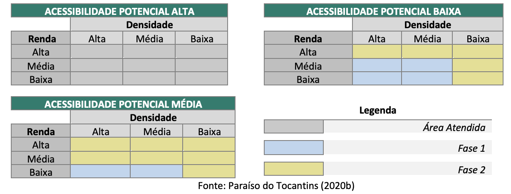
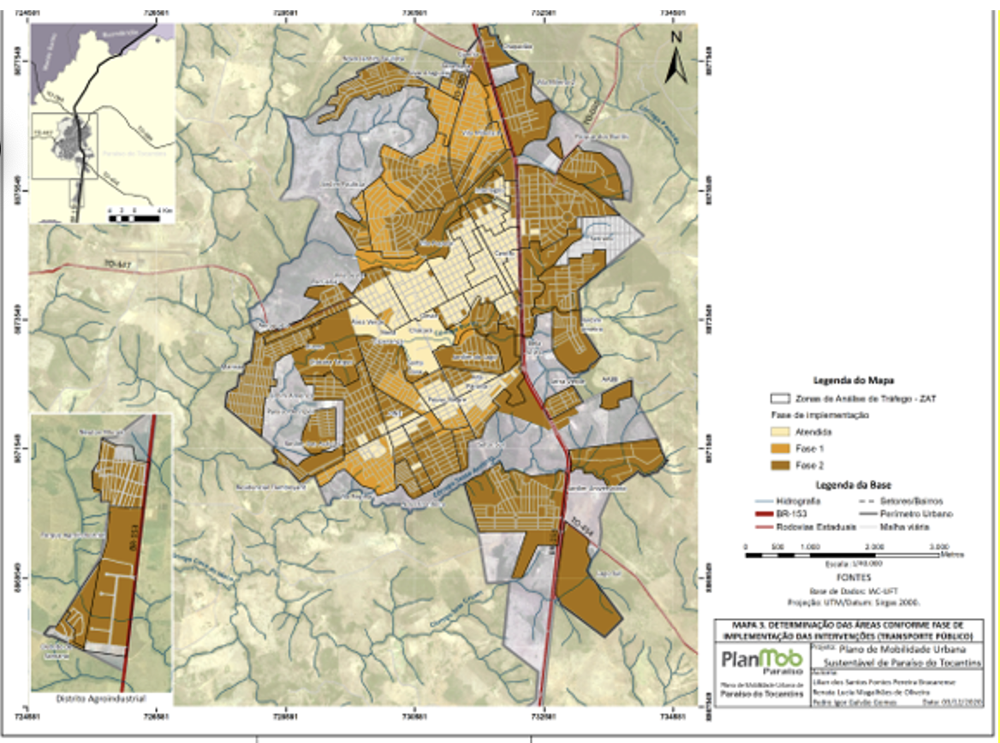

---
output:
  xaringan::moon_reader:
    lib_dir: libs
    css: ["slides.css"]
    nature:
      highlightStyle: github
      highlightLines: true
      countIncrementalSlides: false
      ratio: "16:9"
      beforeInit: "https://platform.twitter.com/widgets.js"
      slideNumberFormat: |
         <div class="progress-bar-container">
           <div class="progress-bar" style="width: calc(%current% / %total% * 100%);">
           </div>
         </div>
    seal: false 
---


```{r child = "setup.Rmd"}
```

```{r xaringan-logo, echo=FALSE}
#xaringanExtra::use_logo(image_url = "img/Image2.png")
```

```{r echo=FALSE}
xaringanExtra::style_panelset_tabs(
  active_foreground = "#4c3a78",
  hover_foreground = "#2c8475",
)
```

```{r xaringan-scribble, echo=FALSE}
xaringanExtra::use_scribble()
```

```{r message=FALSE, warning=FALSE, include=FALSE}
library(tidyverse)
library(readxl)

funcoes <- read_delim("funcoes.csv", delim = ";", 
    escape_double = FALSE, trim_ws = TRUE)

funcoes <- funcoes %>% 
  dplyr::select(-"...1")

imped_active <- read_excel("imped_active.xlsx")

crit <- read_excel("criticidade.xlsx") 


```

.huge[
.center[
Planejando Acessibilidade e Mobilidade nas Pequenas/Médias Cidades Brasileiras
]]

<br></br>

.large[
.purple[
Renata Oliveira e Lílian Bracarense
]]

.big[
.purple[
Seminários 2022 - 11/07/2022
]]

---
class: inverse

# Agenda

--
.larger[
Cidades de pequeno e médio portes
]
--
.larger[
Proposta de planejamento orientado à acessibilidade - Paraíso do Tocantins
]

--
.larger[
Questões de pesquisa
]

---

## Cidades de pequeno porte

.large[
**População menor do que 100.000 habitantes**
]

.panelset.sideways[

.panel[.panel-name[.bigger[
Organização institucional]]
.bigger[
- escassez de dados
- legislação urbanística negligenciada/ com falhas
- escassez de qualificação técnica
- dificuldade de organização para captação de recursos
]]

.panel[.panel-name[.bigger[
Mobilidade Urbana]]
.bigger[
- transporte público precário ou inexistente
- relevância do transporte a pé
- potencial para transporte cicloviário 
- crescimento acelerado de motocicletas
- saturação de tráfego ainda não é um gargalo (situações pontuais)
]]

.panel[.panel-name[Planejamento]
.bigger[
- modelo tradicional baseado em demanda x oferta - recursos que as cidades não têm
- conhecer o carregamento da rede pode ser secundário ou desnecessário
- análise de acessibilidade permite:
  - subsidiar instrumentos urbanísticos
  - estabelecer prioridades de investimentos
  - direcionar vetores de expansão urbana
]]]


---

## Cidades de médio porte

.large[
**População entre 100.000 e 500.000 habitantes**
]

.panelset.sideways[

.panel[.panel-name[Organização institucional]
.bigger[
- existe um nível de organização e bases de dados
- legislação urbanística existente
- alguma qualificação técnica
- organização para captação de recursos
]]

.panel[.panel-name[Mobilidade Urbana]
.bigger[
- transporte público existente, alguma dificuldade de obtenção de dados
- características urbanísticas variáveis (caso a caso)
- potencial para transporte cicloviário 
- crescimento acelerado de motocicletas
- saturação de tráfego pode ainda não ser um gargalo (situações pontuais)
]]

.panel[.panel-name[Planejamento]
.bigger[
- cidades em expansão (polos regionais)
- modelo tradicional baseado em demanda x oferta 
- análise de acessibilidade
    - subsidiar instrumentos urbanísticos (planos diretores, lei de uso e ocupação do solo - análise mais completa do que apenas hierarquia viária e largura)
    - estabelecer prioridades de investimentos
    - direcionar vetores de expansão urbana

]]]

???

modelo tradicional baseado em demanda x oferta é oneroso, dados de origem - destino indisponíveis
conhecer o carregamento da rede em alguns casos pode fornecer informações observáveis por meios menos onerosos (a depender de cada cidade)
---

## Proposta de planejamento orientado à acessibilidade

.large[
**Paraíso do Tocantins**
]

.pull-left[
.big[
- População estimada: 52.521 pessoas (2021)
- IDHM: 0,764 (2010)
- Salário médio mensal dos trabalhadores formais: 1,8 salários mínimos (2020)
- População ocupada: 20,8% (2020)
- Percentual das receitas oriundas de fontes externas: 75,5 %  (2015)
- Urbanização de vias públicas: 3,4 %  (2010)
]

.footnote[
IBGE Cidades
]]

.pull-right[
```{r echo=FALSE, message=FALSE, warning=FALSE, out.width="80%"}

```
]

---

## Proposta de planejamento orientado à acessibilidade

.large[
**Mensurando acessibilidade para diferentes funções**
]

```{r eval=FALSE, message=FALSE, warning=FALSE, include=FALSE}
library(kableExtra)
library(tidyverse)
funcoes %>% 
  kbl(align = "c") %>%
      kable(booktabs = TRUE) %>% 
      pack_rows(index = c("Saúde" = 2, "Educação" = 3, "Lazer e esportes", = 2,  "Comércio e serviços (gerais)" = 1, "Comércio e serviços (especializados)" = 1, "Postos de trabalho" = 1))
```

.pull-left[
```{r echo=FALSE, message=FALSE, warning=FALSE}
library(tidyverse)
library(ftExtra)
library(flextable)
library(gtsummary)

funcoes$Função <- as.factor(funcoes$Função)

grouped_df <- funcoes %>%
   dplyr::group_by(`Função`) %>% 
   select(-`Abrangência`) %>% 
   filter(`Função` == "Saúde" | `Função` == "Educação"| `Função` == "Lazer e esportes" )

ft <- ftExtra::as_flextable(grouped_df, col_keys = names(grouped_df), groups_to = "merged")

ft <- set_table_properties(ft, layout = "autofit", width = 1)

ft


```
]

.pull-right[
```{r echo=FALSE, message=FALSE, warning=FALSE}
library(tidyverse)
library(ftExtra)
library(flextable)
library(gtsummary)

funcoes$Função <- as.factor(funcoes$Função)

grouped_df1 <- funcoes %>%
   dplyr::group_by(`Função`) %>% 
   select(-`Abrangência`) %>% 
   filter( `Função` == "Comércio e serviços (gerais)" | `Função` == "Comércio e serviços (especializados)" | `Função` == "Postos de trabalho")

#funcoes %>% ftExtra::as_flextable(col_keys = names(grouped_iris), groups_to = "merged")

#as_flextable(as_grouped_data(funcoes, "Função", columns = NULL))


ft1 <- ftExtra::as_flextable(grouped_df1, col_keys = names(grouped_df1), groups_to = "merged")


ft1 <- set_table_properties(ft1, layout = "autofit", width = 1)


ft1

```
]

???

.bigger[
Uso de **indicadores de acessibilidade distintos** para **diferentes funções** conforme sua ordem.
]


---

## Proposta de planejamento orientado à acessibilidade

.large[
**Unidade de análise para diferenciação espacial** 
]

```{r echo=FALSE, message=FALSE, warning=FALSE, out.width = "55%"}

```


---

## Proposta de planejamento orientado à acessibilidade

.large[
**Impedância e criticidade nas redes de modos ativos**
]

.pull-left[
```{r echo=FALSE, message=FALSE, warning=FALSE}
library(tidyverse)
library(ftExtra)
library(flextable)


#imped_active$Velocidade padrão (km/h)  <- as.factor(funcoes$Velocidade padrão (km/h))

names(imped_active) <- c("Modo", "Velocidade (km/h)", "Inclinação", "Fator de impedância", "a", "b") 
   
grouped_df3 <- imped_active %>%
   dplyr::group_by(Modo, `Velocidade (km/h)`) %>% 
   select(-c(a, b)) %>%
   filter(`Inclinação` != "Inclinação")
          
#funcoes %>% ftExtra::as_flextable(col_keys = names(grouped_iris), groups_to = "merged")

#as_flextable(as_grouped_data(funcoes, "Função", columns = NULL))


ft3 <- ftExtra::as_flextable(grouped_df3, col_keys = names(grouped_df3), groups_to = "merged")


ft3 <- set_table_properties(ft3,  width = 1, layout = "autofit")


ft3

```
]

.pull-right[
```{r echo=FALSE, message=FALSE, warning=FALSE}
library(tidyverse)
library(ftExtra)
library(flextable)
library(gtsummary)

crit <- crit[2:7,]

crit[,1] <- "Arterial" 

crit[1,4] <- NA 
crit[2,4] <- NA
   
grouped_df4 <- crit %>%
   dplyr::group_by(Hierarquia, `Faixa dupla?`) 

#funcoes %>% ftExtra::as_flextable(col_keys = names(grouped_iris), groups_to = "merged")

#as_flextable(as_grouped_data(funcoes, "Função", columns = NULL))


ft4 <- ftExtra::as_flextable(grouped_df4, col_keys = names(grouped_df4), groups_to = "merged")


ft4 <- set_table_properties(ft4, layout = "autofit", width = 1)


ft4

```
]


---

## Proposta de planejamento orientado à acessibilidade

.large[
**Impedância na rede de transporte público coletivo e tempos de deslocamento**
]

.bigger[
**Tempos** de transporte por **ônibus**
]

.big[
- rede multimodal composta por:    
      (i) deslocamento entre o ponto de origem por modo a pé até o ponto de embarque mais próximo;    
      (ii) tempo de espera estimado a partir do quadro horário;   
      (iii) tempo de deslocamento embarcado, considerando a velocidade média da linha circular que conecta os bairros Vila Regina e Jardim Paulista; e    
      (iv) tempo de deslocamento a pé até o ponto de destino após desembarque 
       
- As características para composição do tempo de deslocamento do pedestre foram mantidas conforme descrição na seção anterior.
]

.footnote[
Cui et al. (2020); Ermagun and Tilahun (2020); Hernandez et al. (2020); Zuo et al. (2020).
]

???

Quanto aos tempos de espera e deslocamento embarcado, foram assumidas premissas específicas. Inicialmente, as linhas que compõe o sistema foram classificadas em dois grupos: (i) linhas circulares; e (ii) linhas de conexão com o IFTO. Assim, para as linhas de conexão com o IFTO, não se consideraram impedâncias adicionais por tempo de espera, visto que o quadro horário visa atender, sem viagens não orientadas a esse objetivo, os horários de início e término dos turnos escolares nessa instituição. Ainda, esse conjunto de linhas foi considerado apenas na determinação dos tempos de deslocamento por ônibus com destino em equipamentos educacionais que ofertam ensino médio e ensino superior. Para as demais funções, consideraram-se apenas as duas linhas circulares. 


Para cômputo da velocidade média por ônibus, foi identificada a velocidade média da linha Vila Regina – Jardim Paulista considerando a extensão do itinerário – 28 km – e o ciclo das viagens de uma hora e dez minutos (1:10’). Assim, assumiu-se a velocidade média dessa linha – 24 km/h – como padrão para todo o sistema. 

O tempo de atraso nas linhas circulares foi calculado considerando o número de pontos de embarque e desembarque (PED) de cada linha e um tempo de atraso equivalente ao ciclo. Para alocação desse tempo na rede, cada link com presença de PED recebeu a alocação do da razão entre o ciclo (1:10’) e o número de aproximações em cada PED. Assim, para a linha Vila Regina – Jardim Paulista, foram alocados 0,52 minutos por link considerando 134 links com PEDs. Para a linha Vila Regina – Hospital Regional, foram considerados 124 links com PEDs e 0,56 minutos por link. 

No caso de ocorrência de mais de um PED no mesmo link, esse tempo de espera foi dividido por 2, pois há defasagem no quadro horário das duas linhas circulares. O resultado desse tempo de espera foi então dividido por 2 caso houvesse mais de uma linha circular com itinerário no mesmo link. Esse procedimento visou incluir a frequência de viagens como um atributo que reduz a impedância quando for mais significativo. 


---

## Proposta de planejamento orientado à acessibilidade

.large[
**Inexistência de dados acessíveis de tempos nos links para transporte individual por automóvel.**
]

.bigger[
Para o **transporte individual motorizado**, considerou-se apenas o tempo de deslocamento na **velocidade-padrão de 40 km/h.**  
]

---

## Proposta de planejamento orientado à acessibilidade

.large[
**Categorização** de cada indicador em **classes** 
]

.pull-left[

```{r echo=FALSE, message=FALSE, warning=FALSE}
library(tidyverse)
library(ftExtra)
library(flextable)
library(gtsummary)

library(readxl)
classes <- read_excel("classes.xlsx")

grouped_df5 <- classes %>%
   dplyr::group_by(`Abrangência`,`Indicador`) %>%
   select(`Indicador`, `Abrangência`, Classes)%>%
   filter(Indicador == "Tempo mínimo"| Indicador == "Cumulativo")

#funcoes %>% ftExtra::as_flextable(col_keys = names(grouped_iris), groups_to = "merged")

#as_flextable(as_grouped_data(funcoes, "Função", columns = NULL))


ft5 <- ftExtra::as_flextable(grouped_df5, col_keys = names(grouped_df5), groups_to = "merged")

ft5 <- set_table_properties(ft5, layout = "autofit", width = 1)


ft5

```
]
.pull-right[
```{r echo=FALSE, message=FALSE, warning=FALSE}
library(tidyverse)
library(ftExtra)
library(flextable)
library(gtsummary)

library(readxl)
classes <- read_excel("classes.xlsx")

grouped_df6 <- classes %>%
   dplyr::group_by(`Abrangência`,`Indicador`) %>%
   select(`Indicador`, `Abrangência`, Classes)%>%
   filter(Indicador == "Potencial")

#funcoes %>% ftExtra::as_flextable(col_keys = names(grouped_iris), groups_to = "merged")

#as_flextable(as_grouped_data(funcoes, "Função", columns = NULL))


ft6 <- ftExtra::as_flextable(grouped_df6, col_keys = names(grouped_df6), groups_to = "merged")

ft6 <- set_table_properties(ft6, layout = "autofit", width = 1)


ft6

```

]

---

## Proposta de planejamento orientado à acessibilidade

.large[
**Categorização** de cada indicador em **classes** 
]

```{r echo=FALSE, message=FALSE, warning=FALSE}
knitr::include_graphics("img/acesso1.png")
```

---

## Proposta de planejamento orientado à acessibilidade

.large[
**Categorização** de cada indicador em **classes** 
]

```{r echo=FALSE, message=FALSE, warning=FALSE}
knitr::include_graphics("img/acesso2.png")
```


---

## Proposta de planejamento orientado à acessibilidade

.large[
**Definição de fases sequenciais de intervenções propostas para cada modo considerando renda, densidade populacional e a acessibilidade** 
]

.pull-left[
```{r echo=FALSE, message=FALSE, warning=FALSE, out.width="100%"}

```
]

.pull-right[
```{r echo=FALSE, message=FALSE, warning=FALSE, out.width="100%"}

```
]

---

## Proposta de planejamento orientado à acessibilidade

.large[
**Definição de fases sequenciais de intervenções propostas para cada modo considerando renda, densidade populacional e a acessibilidade** 
]

.bigger[.bold[
Pedestres
]]

```{r echo=FALSE, message=FALSE, warning=FALSE}

```

---

## Proposta de planejamento orientado à acessibilidade

.large[
**Definição de fases sequenciais de intervenções propostas para cada modo considerando renda, densidade populacional e a acessibilidade** 
]


.bigger[.bold[
Transporte coletivo por ônibus
]]

```{r echo=FALSE, message=FALSE, warning=FALSE}

```

---

## Proposta de planejamento orientado à acessibilidade

.large[
**Definição de fases sequenciais de intervenções propostas para cada modo considerando renda, densidade populacional e a acessibilidade** 
]

```{r echo=FALSE, message=FALSE, warning=FALSE, out.width="50%"}

```

---

## Questões de pesquisa

.large[
.bold[
Mensuração (1/3)
]]

.bigger[
**Quais os indicadores** mais adequados para **mensuração da acessibilidade** a **cidades de menor porte**? É válido utilizar **diferentes indicadores** conforme a **ordem da função**? É necessário considerar uma **função de decaimento da impedância** para cidades de menor porte?
]

---

## Questões de pesquisa

.large[
.bold[
Mensuração (2/3)
]]

.bigger[
**Qual** **nível de detalhamento** (resolução) de **dados** para análises de acessibilidade é suficiente para aplicações que visem dar embasamento à **elaboração de instrumentos urbanísticos**? **Quais ganhos o nível de detalhamento** traz para a **tomada de decisão** em relação aos **instrumentos urbanísticos** (LUOS, Plano Diretor, Plano de Mobilidade)? **Cidades de menor porte** são **mais sensíveis** à **unidade de área** considerada?
]

---

## Questões de pesquisa

.large[
.bold[
Mensuração (3/3)
]]

.bigger[
Justifica-se a utilização de **tempos no deslocamento motorizado** ou a **distância** seria um indicador adequado, visto que os **níveis de congestionamento** não são tão relevantes para **cidades de menor porte**? Uma **pesquisa de velocidade** nas vias (amostral) seria um caminho adequado para **determinação de tempos nos links** para cidades de menor porte?
]

---

## Questões de pesquisa

.large[
.bold[
Escala (1/3)
]]

.bigger[
Como se dá a **participação de cada urbe** dentro de uma **rede de atividades regional**? É relevante caminharmos para a **exploração de escalas intraurbana e interurbana – interligadas por transporte público**? Há impactos em relação à **identificação de iniquidades no acesso a oportunidades**? 
]

---

## Questões de pesquisa

.large[
.bold[
Escala (2/3)
]]

.bigger[
As **divisões administrativas municipais** poderiam ser **desconsideradas** ou seria relevante, como alternativa, considerarmos funções de pertinência para as **transições municipais**?
]

---

## Questões de pesquisa

.large[
.bold[
Escala (3/3)
]]

.bigger[
Existem **diferenças** entre fenômenos em **escala municipal, metropolitana e nas redes urbanas regionais**?
]

---

## Questões de pesquisa

.large[
.bold[
Diagnóstico (1/3)
]]

.bigger[
A **qualidade da infraestrutura** afeta a **acessibilidade**, na **percepção do usuário**? Quais os **reflexos dessa percepção** para o **uso do espaço urbano**, nas diferentes modalidades, sobretudo no **transporte ativo**? **Como** incluir **elementos de infraestrutura** na **análise de acessibilidade** para o **transporte a pé**?
]

---

## Questões de pesquisa

.large[
.bold[
Diagnóstico (2/3)
]]

.bigger[
Em **cidades de menor porte**, existe a **desigualdade socioespacial** da acessibilidade? Existe o fenômeno da **segregação voluntária**? É possível **caracterizar o spatial mismatch** considerando que a **rede de transporte público** atende a população de **baixa renda** e os cidadãos de **alta renda** se deslocam por **modos individuais**? Quais seriam os **fundamentos** para a análise dos problemas de acessibilidade? 
]


---

## Questões de pesquisa

.large[
.bold[
Diagnóstico (3/3)
]]

.bigger[
Considerando que um cenário comum em cidades de menor porte é a **inexistência de transporte público formal**, **como** se conformam as **desigualdades socioespaciais**? Quais **indicadores de acessibilidade** seriam mais adequados para **mensurar problemas** e **desigualdade** na acessibilidade nesse contexto? 
]
---

## Questões de pesquisa

.large[
.bold[
Instrumentos urbanísticos e avaliação (1/3)
]]

.bigger[
As **avaliações** dos projetos quanto ao acesso a oportunidades em **cidades de menor porte** podem ser realizadas utilizando os mesmos métodos de **avaliação ex-ante** propostos para capitais **metropolitanas**? Métodos de **inferência causal** podem auxiliar no **entendimento** (diagnóstico) da **desigualdade socioespacial** para municípios de menor porte? Como fazer **avaliações ex-ante de intervenções** para evitar que essas desigualdades se instalem? 
]

---

## Questões de pesquisa

.large[
.bold[
Instrumentos urbanísticos e avaliação (2/3)
]]

.bigger[
De que maneira análises de acessibilidade podem ser **incluídas em revisões de leis de Parcelamento, Uso e Ocupação do Solo**? Como promover **diretrizes nos planos diretor e de mobilidade** para que a **desigualdade socioespacial** seja **evitada** e não corrigida? 
]


---

## Questões de pesquisa

.large[
.bold[
Instrumentos urbanísticos e avaliação (3/3)
]]

.bigger[
Existem **diferenças** de **potencial de intervenção** por diretrizes de uso do solo e transportes orientadas à acessibilidade entre **cidades maiores e menores**? **Como** essas diferenças podem ser trabalhadas em cada contexto?
]

---

.pull-right[
.huge[
.center[
OBRIGADA!
]]
]

<hr />

.grande[
.center[
renataoliveira@gmail.com

lilianfontes@mail.uft.edu.br
]]


